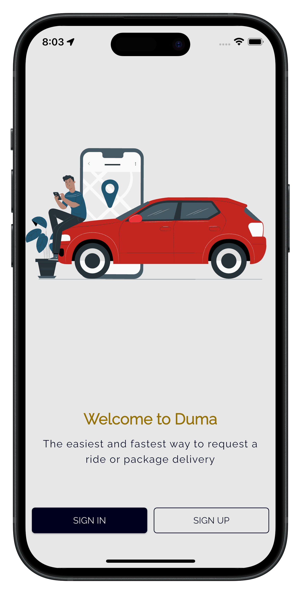
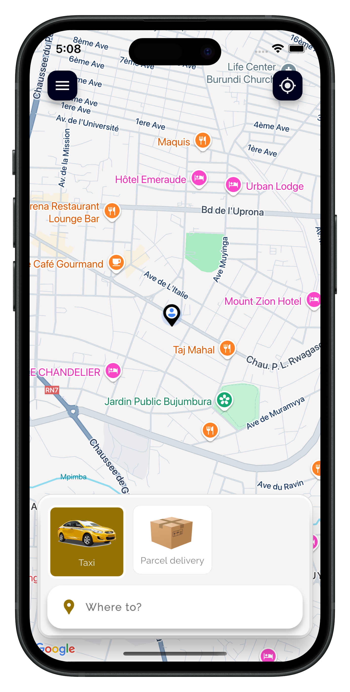
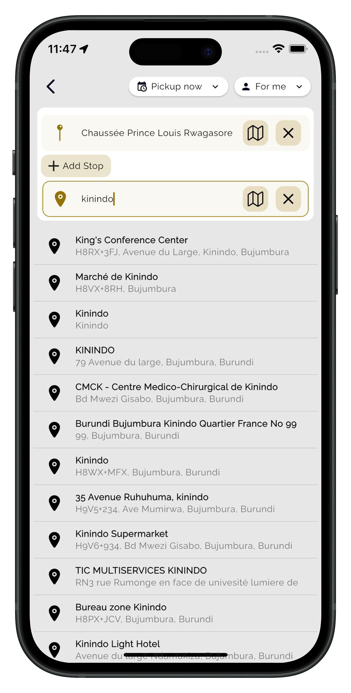
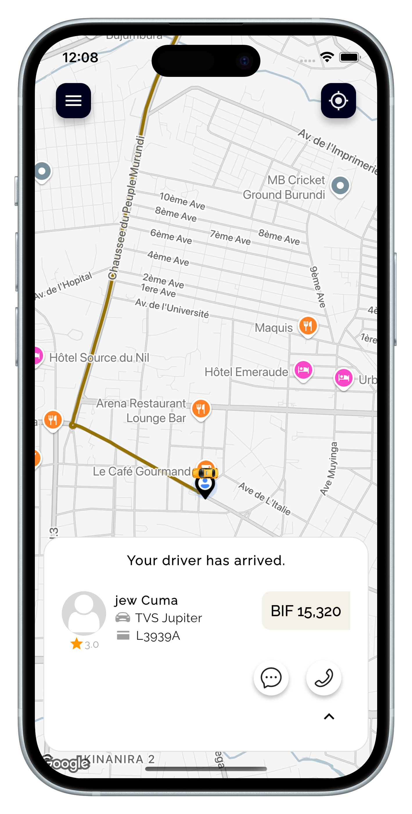
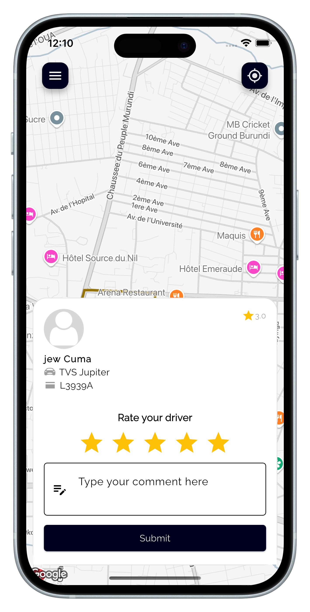

# 🚖 Duma Taxi

A Flutter application for requesting taxi rides or parcel delivery services. Users can create an account or log in, view available drivers on a map, and track their requests in real-time.

---

## ✨ **Features**

- 📍 **Real-time map view** showing nearby drivers
- 🚕 **Request a taxi ride**
- 📦 **Request parcel delivery**
- 👤 **User authentication:** Login and account creation
- 🔔 **Notifications** for ride or parcel status updates

---

## 📸 **Screenshots**

| Home Screen | Available Drivers | Estimation Prices | Real time tracking | Rate Driver
|-------------|-------------|
|  |  |  |  |  |

---

## 🚀 **Getting Started**

### **Prerequisites**

- Flutter SDK (https://flutter.dev/docs/get-started/install)
- Dart SDK
- An emulator or a physical device

### **Installation**

1. **Clone this repository:**

```bash
git clone https://github.com/AFB317/duma_public.git
cd duma_public
